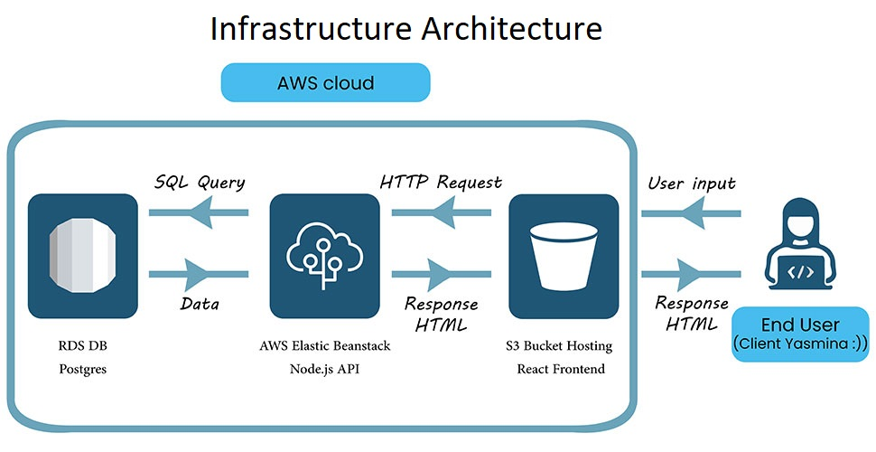
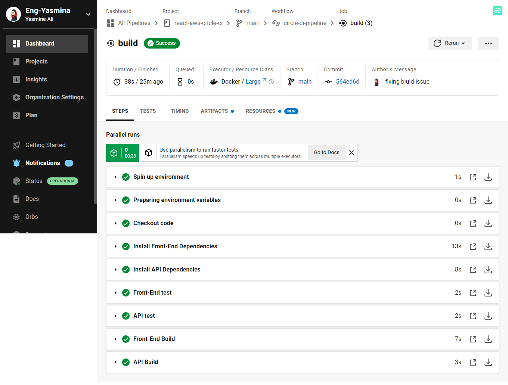

# Hosting a Full-Stack Application
This project is about deploying a Full-Stack application built for a retailer to a cloud service provider (AWS) so that it is available to customers.

***[read my runbook for more details about the automation, pipeline process and configuring the Infrastructure.](https://github.com/Eng-Yasmina/react-aws-circle-ci/tree/main/docs/runbook)***

## Architecture diagram for an overview of the infrastructure :


## Architecture diagram for an overview of the pipeline process :


# Dependencies
- Node v18.12.11 (LTS) or more recent.

- npm 8.19.2 (LTS) or more recent.

- AWS CLI v2.

- ED CLI

- A RDS database running Postgres.

- A S3 bucket for hosting uploaded pictures.

# Installation
1. From the root of the repo, navigate to the server:
```bash
cd server
```
to install the node_modules.
```bash
npm install
```
After installation is done start the api in dev mode with:
```bash
npm run dev
```
Without closing the terminal in step 1, navigate to the client 
```bash
cd client
```
to install the node_modules.
```bash
npm install
```
After installation is done start the react app with:
```bash
npm run start
```
2. Configure infrastructure needs (RDS, S3, Elastic Beanstalk) using the AWS console and AWS CLI and deploy the app to those services.
    - Set up AWS s3 for web hosting via AWS CLI:
    ```bash
    aws s3api create-bucket --bucket yasmina-bucket-1 --region us-east-1
    ```
    
    - Set up AWS RDS for the database via AWS console
    - Set up AWS ElasticBeanstalk for the API via EB CLI
    ```bash
    eb init yasmina-api-aws --platform node.js --region us-east-1
    ```

***[Read the step-by-step Infrastructure description runbook for more details about each step.](https://github.com/Eng-Yasmina/react-aws-circle-ci/blob/main/docs/runbook/Infrastructure%20description.md)***


3. Configure a CircleCI pipeline to automate the deployments and continuously checks the build/unit tests for each push instance to the GitHub repo until the status ```success``` is returned.
    - Write a pipeline file using the config.yml format used by CircleCi
    - Make the pipeline run the front-end unit tests
     ```yml
    jobs:
      build:
       docker:
        - image: cimg/node:18.12.1
       steps: 
       .
       .
       .
      # TODO: Test the frontend
      - run:
          name: Front-End test
          command: cd client && npm run test
      # TODO: Test the API
      - run:
          name: API test
          command: cd server && npm run test
    ```
    - Configure CircleCI through config.yml so that only pushes to the main branch would trigger build by utilizing the job filters feature in the workflow to set that up:
    ```yml
    workflows:
        circle-ci-pipeline:
            jobs:
            - build
                filters:
                    branches:
                        only: main
    ```
    - Configure secrets (Environment Variables) via CircleCI to configure CircleCI pipeline with AWS S3 RDS and Elastic Beanstalk
    1. ```AWS_BUCKET```: S3 bucket used to host static front-end
    2. ```AWS_S3_ENDPOINT```: the url of S# hosted app
    3. ```AWS_ACCESS_KEY_ID```, ```AWS_SECRET_ACCESS_KEY``` :are both AWS user credentials
    4. ```AWS_DEFUALT_REGION```: the AWS region i used
    5. ```POSTGRES_HOST```: RSD database url
    6. ```POSTGRES_DB```: name of the database i've created on RDS
    7. ```POSTGRES_USERNAME```: the username i entered while creating the database on RDS
    8. ```POSTGRES_PASSWORD```: the password i entered while creating the database on RDS
    9. ```DB_PORT```: port of the database i've created on RDS

    - Trigger a successful pipeline on each push to the main branch:
    


***[Read the step-by-step Pipeline process runbook for more details about each step.](https://github.com/Eng-Yasmina/react-aws-circle-ci/blob/main/docs/runbook/Pipeline%20process.md)***

# Built With
- [React](https://reactjs.org/) - Single Page Application Framework
- [Node](https://nodejs.org) - Javascript Runtime
- [Express](https://expressjs.com/) - Javascript API Framework

# Table of contents
- [Project Title](#hosting-a-full-stack-application)
- [Dependencies](#dependencies)
- [Installation](#installation)
- [Built With](#built-with)