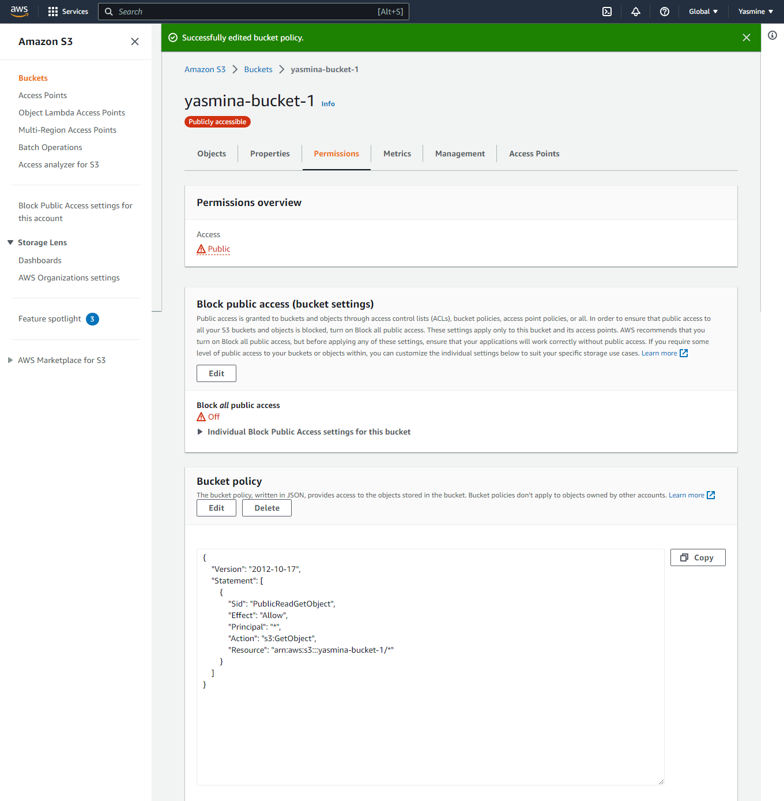
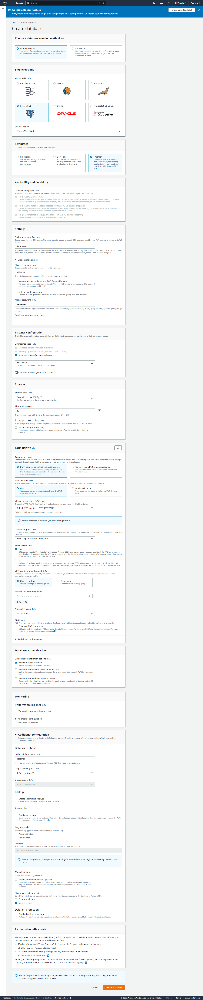
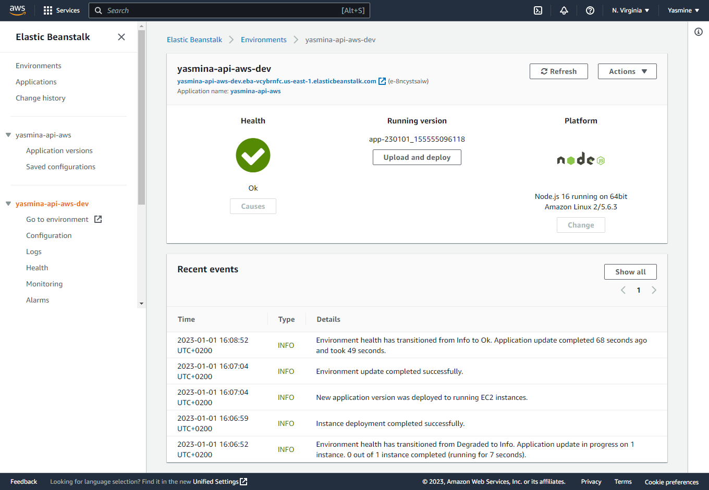

| Runbook name       | Infrastructure description to Host my full stack app  |
| :---------: | :-------------------------------: |
| Runbook description|   This runbook Configure infrastructure needs (RDS, S3, Elastic Beanstalk) using the AWS console and AWS CLI and deploy the app to those services.   |
| On this page       |                 Table of contents                  |
|                       |- [Architecture Diagrams For An Overview Of Tthe Pipeline Process](#architecture-diagrams-for-an-overview-of-the-pipeline-process)                                                       |
|                       |- [Configure Secrets (Environment Variables) Via CircleCI](#configure-secrets-environment-variables-via-circleci)


# Architecture diagrams for an overview of the infrastructure

# Steps to Configureing infrastructure for deployment
## 1. In AWS console, Create a new IAM user. 
## 2. In ternimal, Configure this new user by entring the two user credentials:
- AWS_ACCESS_KEY_ID
- AWS_SECRET_ACCESS_KEY
## 3. set up AWS s3 for web hosting via AWS CLI
```bash
aws s3api create-bucket --bucket yasmina-bucket-1 --region us-east-1
```
- Edit the bucket policy for AWS S3 bucket to change the access for it to be public
```json
{
    "Version": "2012-10-17",
    "Statement": [
        {
            "Sid": "PublicReadGetObject",
            "Effect": "Allow",
            "Principal": "*",
            "Action": [
                "s3:GetObject"
            ],
            "Resource": [
                "arn:aws:s3:::yasmina-bucket-1/*"
            ]
        }
    ]
}
```


- Edit the hosting type of the S3 bucket to enable it to host a static website.


- Upload the static files via deploy script in the package.json scripts:
```json
{
    "scripts": {
        "deploy": "npm run build && aws s3 sync build/ s3://yasmina-bucket-1"
  }
}
```

- My S3 url : `http://yasmina-bucket-1.s3-website-us-east-1.amazonaws.com`


## 4. set up AWS RDS for the database via AWS console



## 5. set up AWS ElasticBeanstalk for the API via EB CLI
. Create a new Elastic Beanstalk Application (yasmina-api-aws):
```bash
eb init yasmina-api-aws --platform node.js --region us-east-1
```
. Create Environment:
```bash
eb create --sample yasmina-api-aws-dev
```
. deploy Archive.zip



