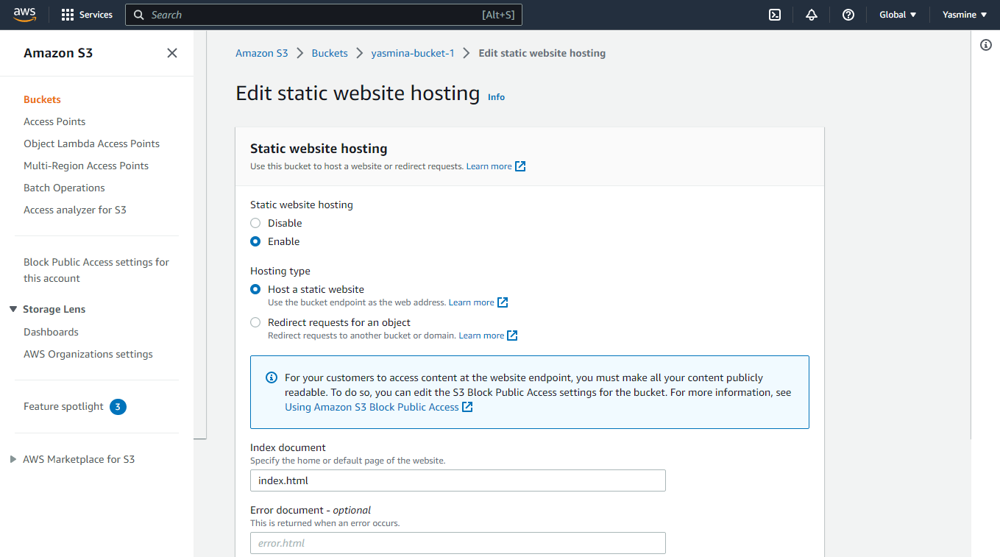

# Runbook name
Infrastructure description to Host my full stack app

# Runbook description
This runbook Configure infrastructure needs (RDS, S3, Elastic Beanstalk) using the AWS console and AWS CLI and deploy the app to those services.


# Steps to Configureing infrastructure for deployment
## 1. I created a new IAM user with ```AdministratorAccess``` 
## 2. I configured the aws cli user with my terminal via:
```bash
 aws configure
```
## 3. I set up AWS s3 for web hosting via AWS CLI
AWS s3 is a AWS's file storage service, so i use this infrastructure so that i can serve static files like HTML and CSS on it.
- I set up it with AWS CLI via:
```bash
aws s3api create-bucket --bucket yasmina-bucket-1 --region us-east-1
```
- I edited the bucket policy for AWS S3 bucket to change the access for it to be public
```json
{
    "Version": "2012-10-17",
    "Statement": [
        {
            "Sid": "PublicReadGetObject",
            "Effect": "Allow",
            "Principal": "*",
            "Action": [
                "s3:GetObject"
            ],
            "Resource": [
                "arn:aws:s3:::yasmina-bucket-1/*"
            ]
        }
    ]
}
```


- I edited the hosting type of the S3 bucket to enable it to host a static website.



- Upload the static files via deploy script in the package.json scripts:
```json
{
    "scripts": {
        "deploy": "npm run build && aws s3 sync build/ s3://yasmina-bucket-1"
  }
}
```

- My S3 url : `http://yasmina-bucket-1.s3-website-us-east-1.amazonaws.com`


## 4. I set up AWS RDS for the database via AWS console
I focused on configuring the following:
- Backups: A copy of your database can be made on a regular interval to avoid losing data if something goes wrong. 
    - i prefered not use backups
- Public or private: A database could be made available on the open web, or only within a private Internet network.
    - i prefered to use public access


## 5. I set up AWS ElasticBeanstalk for the API via EB CLI
I use the infrastructure because it provides an easy solution to hide the following:
- My private API keys.
- My database connection strings.
- My environment-specific information.
1. I created a new Elastic Beanstalk Application (yasmina-api-aws):
```bash
eb init yasmina-api-aws --platform node.js --region us-east-1
```
2. I created Environment:
```bash
eb create --sample yasmina-api-aws-dev
```
3. I deploy Archive.zip


# Architecture diagram for an overview of the infrastructure


