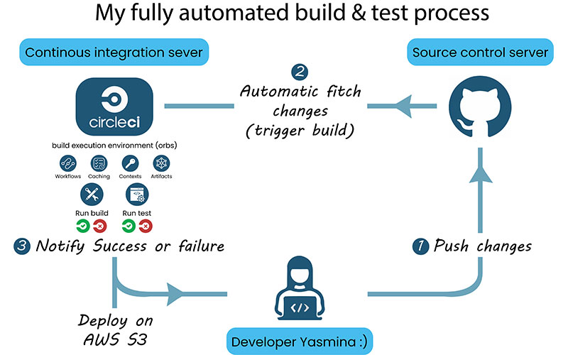
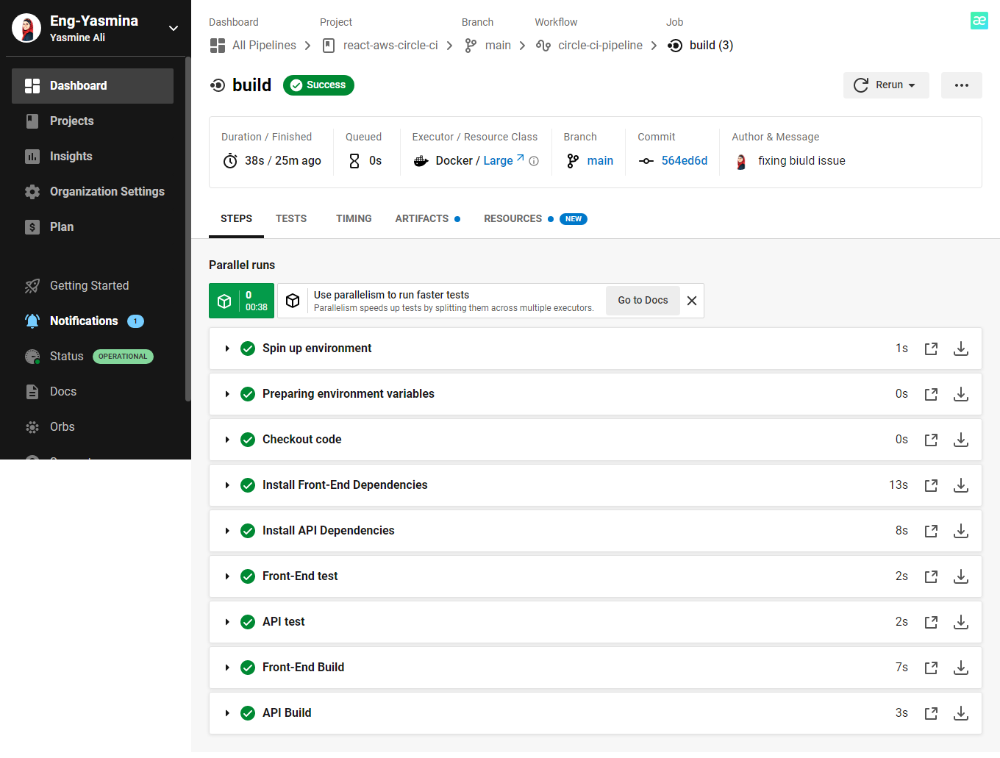
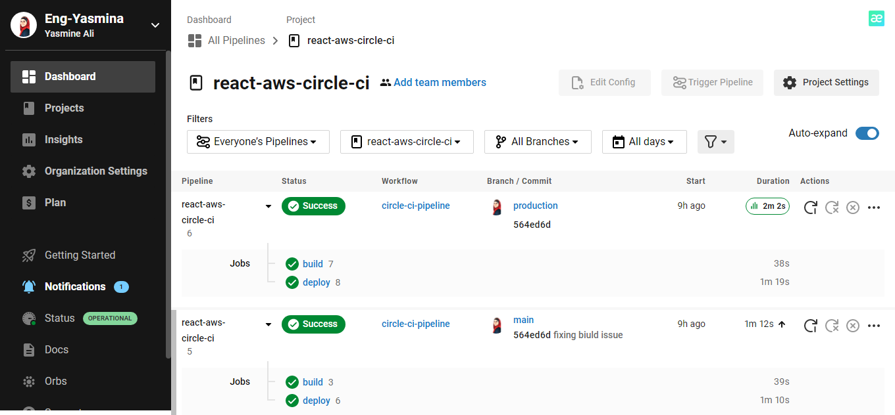

| Runbook name       |             Automation and pipeline process    |
| :----:         |                        :-----:  |
| Runbook description|   This runbook Configures a CircleCI pipeline to automate the deployments and continuously checks the build/unit tests for each push instance to the GitHub repo until the status ```success``` is returned.   |                           
|On this page       |                 Table of contents :
|  |- [Architecture Diagram For An Overview Of Tthe Pipeline Process](#architecture-diagram-for-an-overview-of-the-pipeline-process)
|  |- [Steps to Configuring Continuous Integration Pipeline with Github](#steps-to-configuring-continuous-integration-pipeline-with-github)
|  |- [Configuring CircleCI pipeline with AWS S3, RDS and Elastic Beanstalk](#configure-secrets-environment-variables-via-circleci-to-configure-circleci-pipeline-with-aws-s3-rds-and-elastic-beanstalk)

 

# Architecture diagram for an overview of the pipeline process


# Steps to Configuring Continuous Integration Pipeline with Github
## - Write a pipeline file using the config.yml format used by CircleCi
```yml
version: 2.1

orbs:
  aws-cli: circleci/aws-cli@2.0.3
  eb: circleci/aws-elastic-beanstalk@1.0.0

jobs:
  build:
    docker:
      - image: cimg/node:18.12.1
    steps:     
      - checkout
      # Use root level package.json to install dependencies in the frontend app
      - run:
          name: Install Front-End Dependencies
          command: cd client && npm install
      # TODO: Install dependencies in the the backend API          
      - run:
          name: Install API Dependencies
          command: cd server && npm install
      # TODO: Build the frontend app
      - run:
          name: Front-End Build
          command: cd client && npm run build
      # TODO: Build the backend API      
      - run:
          name: API Build
          command: cd server && npm run build

  deploy:
    docker:
      - image: cimg/node:18.12.1
      # more setup needed for aws, elastic beanstalk
    steps:
      - eb/setup
      - aws-cli/setup
      - checkout
      - run:
          name: Install Front-End Dependencies
          command: cd client && npm install
      - run:
          name: Install API Dependencies
          command: cd server && npm install
      - run:
          name: Deploy App
          # TODO: Install, build, deploy in both apps
          command: cd client && npm run deploy
            
workflows:
  circle-ci-pipeline:
    jobs:
      - build
      - deploy:
          requires:
            - build
```
## - Make the pipeline run the front-end unit tests
```yml
jobs:
  build:
    docker:
      - image: cimg/node:18.12.1
    steps: 
    .
    .
    .
      # TODO: Test the frontend
      - run:
          name: Front-End test
          command: cd client && npm run test
      # TODO: Test the API
      - run:
          name: API test
          command: cd server && npm run test
```

# - Configure secrets (Environment Variables) via CircleCI to configure CircleCI pipeline with AWS S3 RDS and Elastic Beanstalk
1. ```AWS_BUCKET```: S3 bucket used to host static front-end
2. ```AWS_S3_ENDPOINT```: the url of S# hosted app
3. ```AWS_ACCESS_KEY_ID```, ```AWS_SECRET_ACCESS_KEY``` :are both AWS user credentials
4. ```AWS_DEFUALT_REGION```: the AWS region i used
5. ```POSTGRES_HOST```: RSD database url
6. ```POSTGRES_DB```: name of the database i've created on RDS
7. ```POSTGRES_USERNAME```: the username i entered while creating the database on RDS
8. ```POSTGRES_PASSWORD```: the password i entered while creating the database on RDS
9. ```DB_PORT```: port of the database i've created on RDS


## - Trigger a successful pipeline on each push to the main branch:



## - Make Pull Requests builds so that each time i open a pull request against the main branch, my tests and build are executed.


